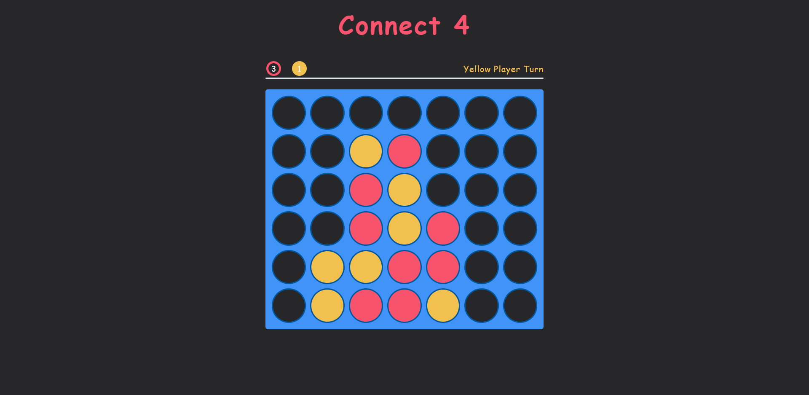
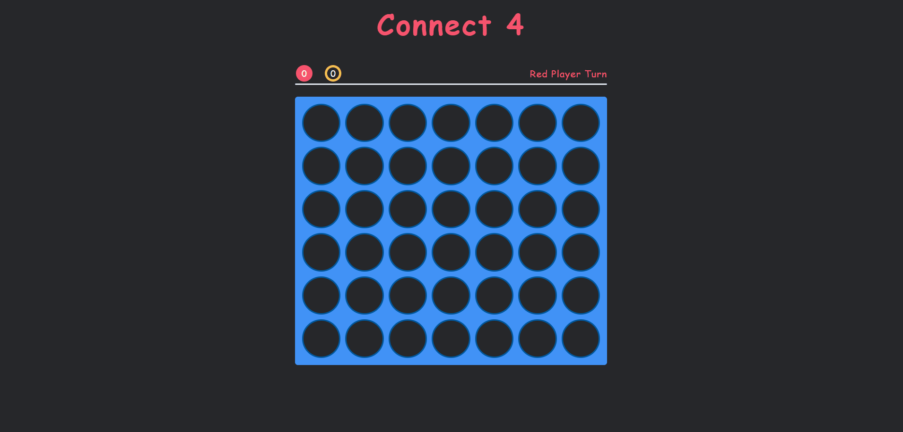

# Connect 4 Game

This is a two-player Connect 4 game built with JavaScript. 
The goal of the game is to be the first player to get four of their pieces 
in a row vertically, horizontally or diagonally.

## How To Play
When the game loads, players take turns dropping their colored pieces (red or yellow) 
into one of the seven columns of the game board. Pieces will fall to the lowest available open spot in that column.
The game ends when either a player gets four of their pieces in a row, completing a "connect 4", 
or all spots on the board are filled with no winner, resulting in a draw/tie.

## Overview

## Demo
> This gif shows a brief overview of the project, and it may take a while to load!

## Getting Started
To clone and run this project locally, follow these steps:
- Clone the Repository: git clone https://github.com/mohammedamcs/connect4-game.git
- Navigate to the project directory: cd connect4-game
- Open the index.html file in your preferred web browser.

